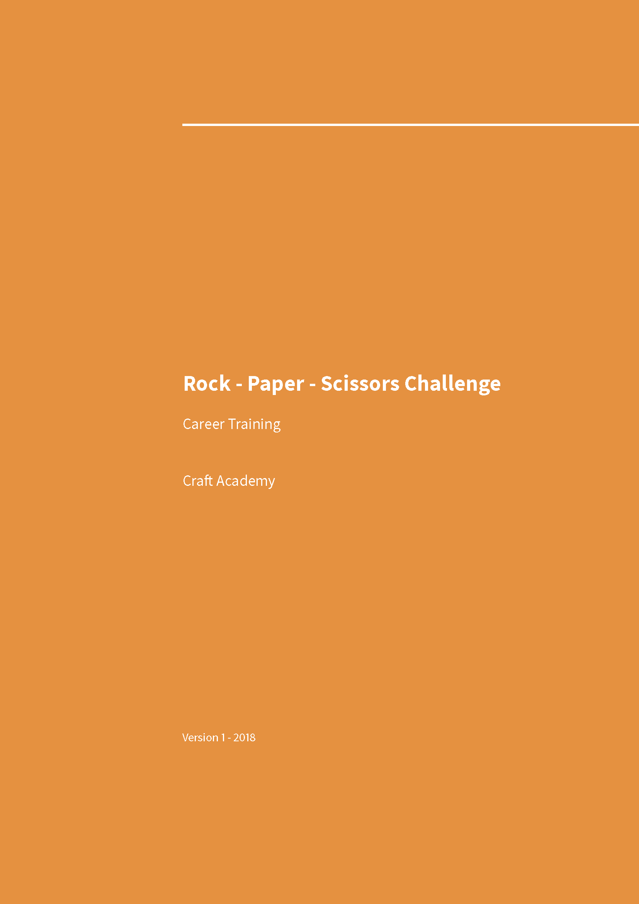
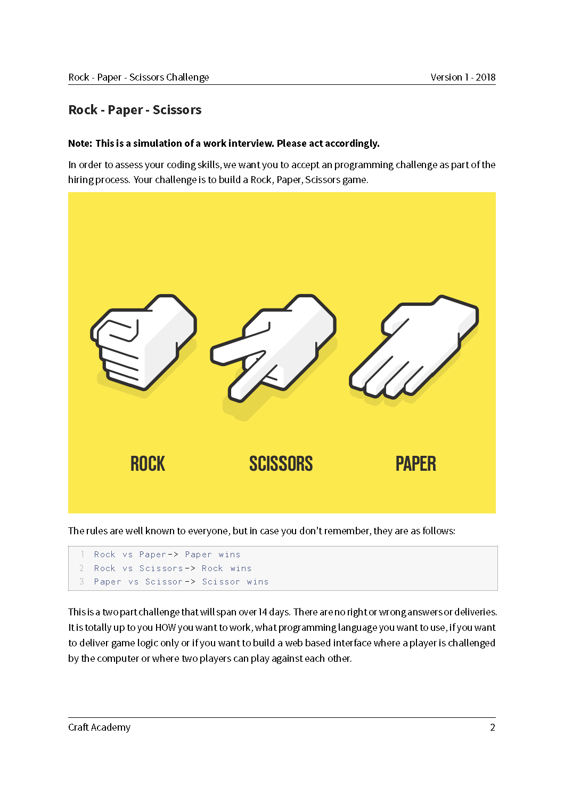
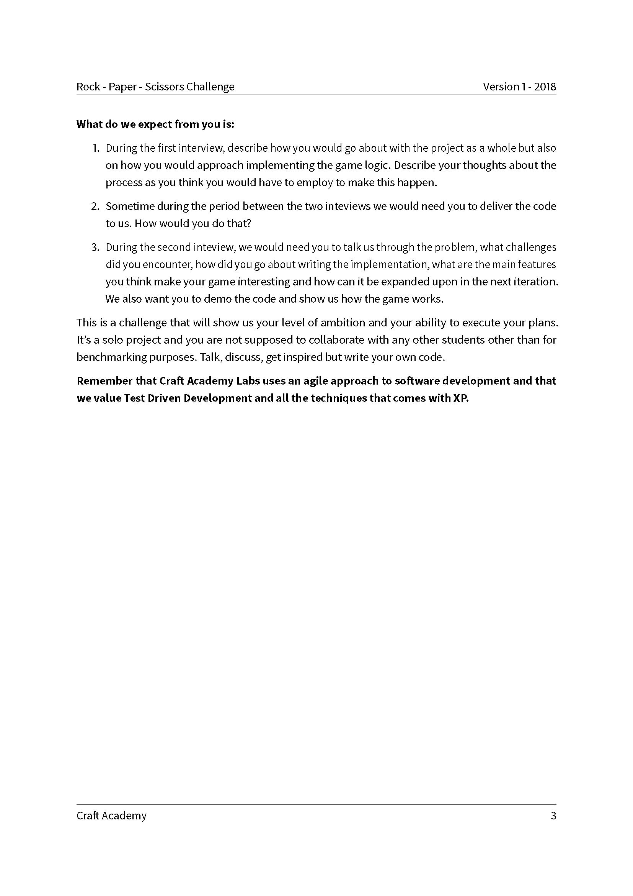

# RPS challenge - week 5 of bootcamp CraftAcademy 2021
## built with these framworks and dependencies
- React 17.0.2
- Yarn
- Cypress
- Css 

## Click the link below to play the game:
[Deployed at Netlify](https://rockpaperscissors-game-single-player.netlify.app/)


[](https://dorianbuck.semaphoreci.com/projects/rps_ca_challenge)
[](https://app.netlify.com/sites/rockpaperscissors-game-single-player/deploys)

## Setup
To test this application, fork the repo to your own GitHub account and clone it to your local workspace.

Install all of the dependencies:

`$ yarn install`

Start cypress and run the feature tests:

`$ yarn run cy:open $ yarn start`

## User Stories

```
As a user In order have fun and play a game of chance by picking the right kind of weapon

As a user I will choose one of three object to win over my apponent

As a user I would like to see the results of the game

```
## License
MIT-license
## Acknowledgement
I would like to thank the coaches of CA for the support and help. I managed to find some answers on my own and it gave me a huge boost of confidence

### Sources for this challenge



